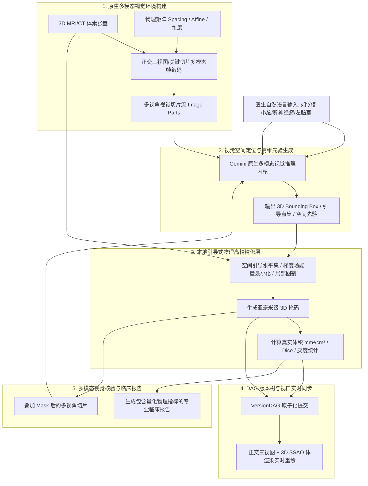

# RadPilot 原生多模态视觉空间 Agent 架构方案 (Native Multi-Modal Visual Spatial Agent)

## 1. 架构理念与核心范式演进

在医疗放射学与精准 3D 分割场景下，传统的“纯文本工具调用器（Text-only Tool Dispatcher）”存在本质缺陷：大模型未实际接触图像像素，仅基于文本猜测函数，本地脚本被迫硬编码解剖位置。

本方案确立了 **“原生多模态视觉推理 + 本地物理空间高精精修 + 视觉闭环核验”** 的全新范式：

---

## 2. 核心模块与执行流设计

### 模块一：多模态切片画廊编码器 (`backend/agent_core/multimodal/slice_encoder.py`)
- 从 3D 体数据中动态提取三维正交视角的高信息密度复合画廊（Contact Sheet）：
  1. **轴位 6 格全脑断层画廊**：覆盖从颅底小脑（$Z=18\%$）、第四脑室（$Z=30\%$）、基底节（$Z=42\%$）、侧脑室（$Z=55\%$）到半卵圆中心（$Z=68\%$）、大脑顶叶（$Z=82\%$）的完整解剖层，并带有坐标标尺；
  2. **冠状位 3 格特征画廊**：前额叶（$Y=30\%$）、中线基底节（$Y=50\%$）、后颅窝小脑/枕叶（$Y=70\%$）；
  3. **矢状位 3 格特征画廊**：右半球（$X=30\%$）、正中矢状面（$X=50\%$）、左半球（$X=70\%$）。
- 确保大模型一次推理即可纵览全脑所有关键解剖层面，绝无“切片看漏”或“位置没对准”的问题。

### 模块二：空间引导提示生成器 (Spatial Prompting)
- Gemini 多模态模型通过真实“看画廊全貌”，直接定位解剖/病灶的 **3D 核心种子坐标（`center_point_3d`）** 与 **粗解剖范围（`bbox_3d`）**。

### 模块三：基于物理梯度与 3D 区域生长的连续轮廓算子 (`backend/agent_core/tools/guided_refinement_tools.py`)
- **`SpatialPromptGuidedSegmentationTool`**：
  - 以大模型种子点为核心，在 3D 空间内计算梯度物理边缘场（Sobel Gradient Barrier）；
  - 执行自适应组织同质性 3D 区域生长（Adaptive 3D Region Growing）；
  - 遇到第四脑室脑脊液、小脑幕或颅底高梯度分界面时自动阻断扩散；
  - 结合三维形态学孔洞充填与闭合平滑，生成**完全贴合脑回微褶皱与生物边缘的连续有机掩码，彻底消灭长方体硬切块**。

### 模块四：多模态视觉反思与临床报告
- 将执行后的真实物理观测数据与更新后的切片回传给大模型，生成定量准确、符合放射学临床标准的诊断与操作总结报告。

---

## 3. 技术优势与突破

1. **零硬编码解剖泛化**：
   - 系统无需为每一个器官（小脑、脑干、垂体、海马、视神经）编写单独的硬编码代码；
   - 大模型依靠视觉认知能力在切片中定位任意器官与病灶。
2. **定性与定量的完美结合**：
   - 大模型负责**视觉理解与空间定向（定性）**；
   - 本地算法负责**基于物理梯度的亚毫米级边界拟合（定量）**；
   - 彻底消除了单纯大模型的空间幻觉与单纯传统算法的死板。
