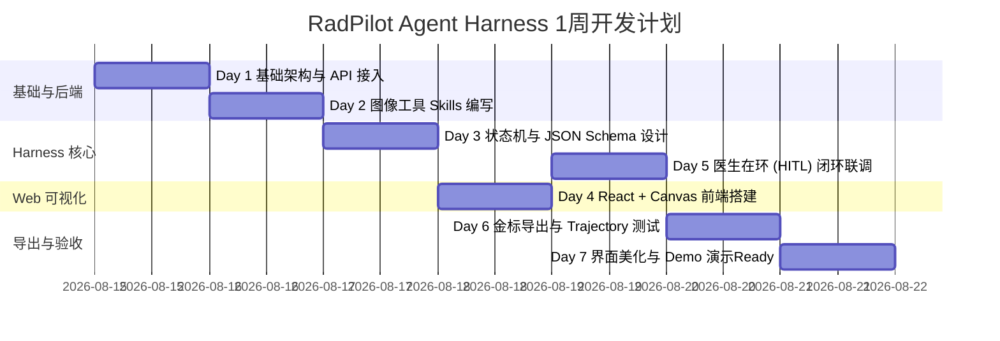

# RadPilot Agent Harness 项目开发计划书
**自然语言交互式医疗图像标注与“金标”生成 Agent 副驾驶系统**

---

## 1. 项目背景与业务痛点

在医疗图像 AI 模型的研发过程中，高精度的“金标（Ground Truth）”数据集是决定模型性能的关键基石。然而，当前研发面临两大核心痛点：

1. **人工标注成本极高且过程枯燥**：医疗图像（DICOM/NIfTI）的精细标定需要放射科专家手动逐帧绘制病灶轮廓，耗时巨大且极其繁琐。
2. **缺乏自然语言交互式的智能修正机制**：传统 AI 辅助标注工具通常只提供固定算法输出，缺乏“大模型生成初标 ➔ 医生通过自然语言口述修正指令 ➔ Agent 自动调整 Mask ➔ 医生确认导出金标”的闭环系统。

本项目旨在构建 **RadPilot** —— 一个专门面向放射科医疗图像标注的 **Agent Harness 框架系统**（RadPilot Agent Harness），结合多模态大模型 API 与图像处理工具链，打造可视化、可交互、可版本回滚的医生在环（Human-in-the-Loop）金标生成 AI 副驾驶工作站。

---

## 2. 架构设计与定位：Skill vs Harness

RadPilot 并非单纯的工具函数（Skill），而是一套完整的 Agent 运行、管理与评测基础设施（Harness）：

```
┌────────────────────────────────────────────────────────────────────────┐
│                      RadPilot Agent Harness 系统                       │
│                                                                        │
│  ┌─────────────────────────┐  自然语言+DICOM图像 ┌───────────────────┐  │
│  │ Web Canvas 交互可视化端  │ ─────────────────> │ Multi-modal LLM   │  │
│  │ (医生看图/自然语言对话)  │ <───────────────── │ (API 意图解析)   │  │
│  └────────────┬────────────┘  Structured JSON    └───────────────────┘  │
│               │                                                        │
│  ┌────────────▼─────────────────────────────────────────────────────┐  │
│  │ RadPilot 核心状态机 (Agent State Machine & HITL Controller)      │  │
│  │ - 医生在环挂起与恢复 (Pause / Resume)                            │  │
│  │ - Mask 标注轨迹与版本线谱树 (Mask Lineage Tree v1->v2->v3)       │  │
│  └────────────┬─────────────────────────────────────────────────────┘  │
│               │ 调度执行工具                                           │
│  ┌────────────▼─────────────────────────────────────────────────────┐  │
│  │ Medical Image Skills Engine (图像处理工具箱)                     │  │
│  │ (pydicom / SimpleITK / OpenCV / MedSAM 分割算子)                  │  │
│  └────────────┬─────────────────────────────────────────────────────┘  │
│               │ 打包导出                                               │
│  ┌────────────▼─────────────────────────────────────────────────────┐  │
│  │ 金标数据集与 Trajectory 日志导出器 (NIfTI / COCO / JSON)         │  │
│  └──────────────────────────────────────────────────────────────────┘  │
└────────────────────────────────────────────────────────────────────────┘
```

* **Skill 层面**：封装 DICOM 解析、形态学膨胀/腐蚀、连通域擦除、MedSAM 点框提示分割等算子。
* **Harness 框架层面**：提供多模态画布可视化渲染、自然语言意图到工具参数的转换映射、医生在环（Pause/Resume）状态中断唤醒、Mask 历史版本树管理及自动化 Trajectory 评测报告导出。

---

## 3. 技术栈选型 (Technology Stack)

| 模块 | 技术选型 | 说明 / Rationale |
| :--- | :--- | :--- |
| **前端交互 (Web UI)** | React + Vite + TailwindCSS + HTML5 Canvas | 高性能图层叠加（DICOM 原图 + 半透明 Mask），便于 AI 高效生成代码 |
| **后端服务 (Backend)** | Python 3.10+ / FastAPI / Uvicorn | 异步高性能 Web 服务，原生支持 Python 医疗图像生态 |
| **图像工具链 (Skills Engine)** | `pydicom`, `SimpleITK`, `OpenCV`, `MedSAM` | DICOM 解析、形态学调整、ROI 提取与深度学习分割算子 |
| **大模型 API (LLM Integration)** | OpenAI API 兼容协议 Client (OpenAI/Claude/DeepSeek) | 支持传入图像预览 + 自然语言指令，输出结构化 Function Call JSON |
| **状态与轨迹管理 (Harness)** | 自研内存/SQLite 状态机 + JSON Trajectory 库 | 管理 Pause/Resume 医生挂起恢复状态、Mask 版本控制 |

---

## 4. 核心功能与模块设计

### 4.1 前端可视化模块 (RadPilot Visual Studio)
* **双层 Canvas 渲染**：底层渲染 DICOM 灰度图像（支持窗宽窗位 HU 值调整），顶层实时渲染半透明彩色 Mask。
* **医生对话与控制面板**：提供自然语言输入框（如：“把左上角结节外扩 2mm”）、Mask 透明度滑动条、版本切换与“确认导出金标”按钮。

### 4.2 多模态 LLM 意图解析 (API Router)
* 系统将当前 DICOM 截图 + 医生口述指令发送至 Vision LLM API。
* LLM 基于 Structured JSON Schema 解析出意图（如：`EXPAND_MASK`, `SHRINK_MASK`, `REMOVE_ARTIFACT`, `REFINE_MEDSAM`）及对应参数。

### 4.3 RadPilot 状态机与版本树 (Pause/Resume Controller)
* **状态转换**：`IDLE` ➔ `AGENT_PROCESSING` ➔ `PAUSED_FOR_DOCTOR` ➔ `RESUMED` ➔ `SAVED`。
* **版本追溯**：记录每一步调用的工具、输入的 Prompt、产生的 Mask 路径，支持 `Undo` 回滚与多版本对比。

### 4.4 金标导出与 Trajectory 统计
* **金标文件**：一键导出与原始 DICOM 严格对齐的 3D NIfTI (`.nii.gz`) 或 2D PNG/COCO 金标。
* **轨迹文件**：导出标准化 `trajectory.json`，可用于分析 Agent 的意图理解准确度与交互效率。

---

## 5. 1 周（7天）AI 协同开发实施路线图



### 每日开发任务拆解：

* **Day 1：基础设施与多模态 API 接入**
  * 搭建 FastAPI 项目骨架与 CORS 跨域配置。
  * 编写 DICOM 文件解析接口（读取 DICOM 序列、HU 窗宽窗位映射转换）。
  * 接入 OpenAI API 兼容 Client，封装 Vision LLM 异步调用与错误重试逻辑。

* **Day 2：医疗图像工具集 (Image Tool Skills) 编写**
  * 封装 `expand_mask(pixels)` / `shrink_mask(pixels)`（OpenCV 膨胀/腐蚀算子）。
  * 封装 `remove_isolated_artifacts()`（连通域提取与离散伪影过滤）。
  * 封装 `refine_roi_medsam(box/point)`（MedSAM / 简易分割模型调用点）。

* **Day 3：RadPilot 核心状态机与 Prompt / Schema 设计**
  * 编写 System Prompt 约束 LLM 强输出 Structured Tool Call JSON。
  * 实现 Harness 内存状态管理器，支持记录 `Mask v1`, `v2`, `v3` 演变历史。
  * 实现回滚（Undo）逻辑与修改历史追溯。

* **Day 4：React + Canvas Web 可视化前端搭建**
  * 使用 React + Vite + Tailwind 快速构建 Web 交互界面。
  * 实现 HTML5 Canvas 双层渲染逻辑（DICOM 灰度底图 + 半透明 Mask 图层）。
  * 增加交互控件：Mask 透明度调节、调色板、撤销按钮、发送指令输入框。

* **Day 5：医生在环 (HITL) 自然语言交互闭环联调**
  * 前后端 API 联调：“医生输入自然语言 ➔ 前端发给 RadPilot ➔ Agent 调 LLM 解析 ➔ 调度 Tool 产生 Mask vN ➔ 前端 Canvas 实时刷出新 Mask”。
  * 优化极简 Prompt 响应速度与异常提示。

* **Day 6：金标数据集导出与 Trajectory 日志测试**
  * 实现导出标准 NIfTI (`.nii.gz`) 和 PNG 金标功能。
  * 实现导出包含完整医生交互与 Tool 执行步骤的 `trajectory.json`。
  * 使用 3-5 组测试 DICOM 数据进行全流程压测与准确率验证。

* **Day 7：界面美化、验收与 Demo 演示 Ready**
  * 优化 UI 视觉风格（医疗蓝色调、深色模式、Agent 思考动画）。
  * 编写项目 README 文档与使用说明。
  * 录制演示 Demo 视频或准备现场演示场景。

---

## 6. 风险控制与预案

1. **多模态大模型响应延迟风险**：
   * *预案*：前端添加流式/加载动画（“RadPilot 正在分析图像与指令...”），后端引入缓存层避免重复调用。
2. **DICOM 图像格式兼容性风险**：
   * *预案*：统一在后端转换为标准的 PNG/Numpy 数组进行交互与渲染，屏蔽异构 DICOM 差异。
3. **图像修改算子越界风险**：
   * *预案*：在 Tool 内部设置边界检查与异常捕获，确保生成的 Mask 不越界且不破坏原始图像尺寸。
